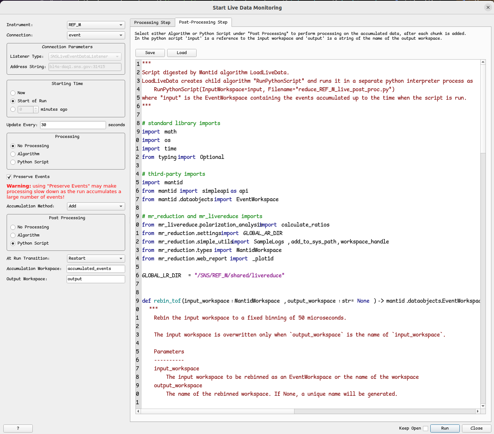

.. _livereduction:

Live Reduction
==============

A general description of the live reduction workflow is found in the User documentation,
under Section :ref:`using_reduce_script/live_reduction`.

Deployment
----------

The steps to fully deploy the live reduction system are:

- Update pixi environment ``mr_reduction`` or ``mr_reduction-qa`` by deploying a new version.
  If we are testing a new feature, we'll be deploying the pixi environment ``mr_reduction-qa``.
- It may be necessary to update file /etc/livereduce.conf with the new version of the pixi environment.
  Contact Linux-support for this because the file is managed by the configuration management tool "puppet".
  Let them know what the contents of the file should be.
- After the pixi environment is updated, manually copy the post-processing file:

.. code-block:: bash

   $ cp /usr/local/pixi/mr_reduction-qa/.pixi/envs/default/lib/python3.10/site-packages/mr_livereduce/reduce_REF_M_live_post_proc.py \
      /SNS/REF_M/shared/livereduce/

This should be enough, as the livereuduction service will automatically pick up the new post-processing script.
If after a few minutes, there seem to be no changes in the web monitor, try restarting the service:

.. code-block:: bash

   $ sudo systemctl restart livereduce

Testing the Post-Processing Script with StartLiveData
-----------------------------------------------------

To test the post-processing script
`reduce_REF_M_live_post_proc.py <https://github.com/neutrons/MagnetismReflectometer/blob/next/src/mr_livereduce/reduce_REF_M_live_post_proc.py>`_
, we can use Mantid algorithm
`StartLiveData <https://docs.mantidproject.org/nightly/algorithms/StartLiveData-v1.html>`_.
It is necessary that the machine running this algorithm has write access to the /SNS/REF_M/ directory
because the live reduction will write output files there. The analysis machines seem like a good candidate.

To familiarize yourself with the basic usage of algorithm StartLiveData,
please read the
`Live Data User Interface webpage <https://docs.mantidproject.org/v4.0.0/tutorials/mantid_basic_course/live_data_analysis/03_live_data_user_interface.html>`_
where you can find descriptions for most of its options.

In our case, you need to first activate the pixi environment ``mr_reduction`` and then start Mantid's workbench

.. code-block:: bash

   $ pixi shell --manifest-path /usr/local/pixi/mr_reduction

   (mr_reduction)
   $ workbench

Open the settings (File -> Settings) and under tab ``General``,
set ``Facility`` to ``SNS`` and ``Default Instrument`` to ``REF_M``.

Invoke the ``StartLiveData`` algorith with the following property settings:

It is necessary that the local machine is connected to the network serving the machines at SNS.
In this scenario, the ``Connection Parameters`` will automatically set to ``SNSLiveEventDataListener``
with the appropriate ``Address String``.

Select `Start of Run` for `Starting Time`. This means that the first time we connect to the live data stream,
we'll collect not just the current chunk of events but all events since the beginning of the run.
This is possible because the live data server stores all past events in a buffer.

Select ``No Processing`` for ``Processing``. This means that we don't apply any processing to the latest chunk of events.
By selecting ``Add`` for the ``Accumulation Method``, we just add the latest chunk of events to the ``EventsWorkspace``
containing all past events. We set the name of this workspace to ``accumulation_workspace``.

If the current experiment happens to finish and a new one starts while we are connected to the live data stream,
we will erase all events from ``accumulation_workspace`` and start afresh.
This is what ``Restart`` for property `At Run Transition` means.

Select ``Python Script`` for ``Post Processing``.
Then in tab ``Post-processing Step``, click in ``Load`` and select script
`reduce_REF_M_live_post_proc.py <https://github.com/neutrons/MagnetismReflectometer/blob/next/src/mr_livereduce/reduce_REF_M_live_post_proc.py>`_.
Better still, make a copy of this script and load the copy because we will need to modify it a bit.
We don't want to pollute the canonical live-reduction directory with our post-processing so change line

.. code-block:: python

   GLOBAL_LR_DIR = "/SNS/REF_M/shared/livereduce"

to something like

.. code-block:: python

   GLOBAL_LR_DIR = "/tmp/my_livereduce"

and create the directory if it doesn't exist.

Now it's time to start the algorithm by clicking on ``Run``.
The algorithm starts collecting events in the ``accumulation_workspace``.
In addition, the algorithm starts executing the post-processing script
``reduce_REF_M_live_post_proc.py`` and will do so every 30 seconds, as specified in property ``Update Every``.
Whenever ``reduce_REF_M_live_post_proc.py`` finishes,
output reduction files are written to directory ``/SNS/REF_M/IPTS-XXXX/shared/autorereduce/``,
where ``XXXX`` is the IPTS number of the current experiment.

In addition, log file ``livereduce_REF_M.log`` is created under ``/tmp/my_livereduce``.
Errors may be written here and also in the ``Messages`` area of the workbench.

Troubleshooting
---------------

Refer to the troubleshooting section :ref:`troubleshoot/live_reduction`
