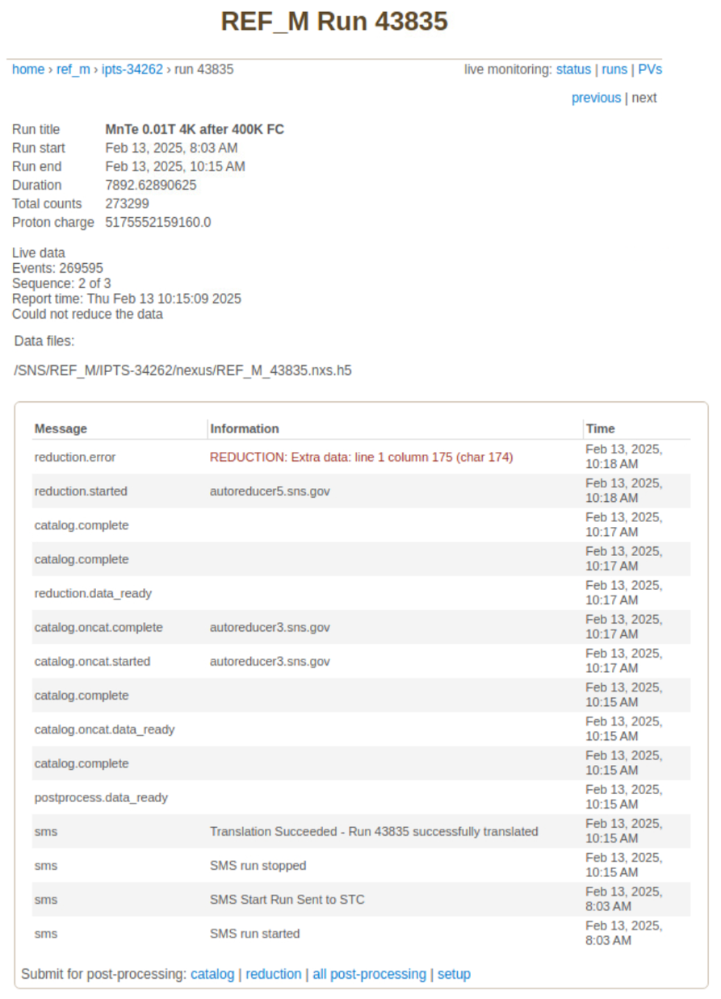
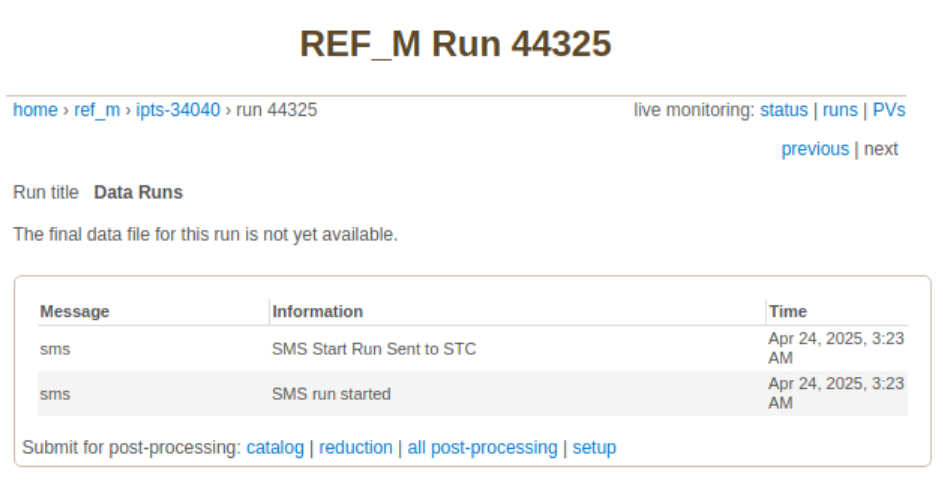

.. _troubleshoot:

Troubleshooting
===============

Autoreduction
-------------

The autoreduction system is a complex system that can fail for many reasons.
This section provides a list of common issues and their solutions.

The general entry point for an autoreduction fail is a reported error in monitor.sns.gov.

Usually, the error message is very succinct or is trimmed. For the complete error trace,
look at the error log file

.. code-block:: bash

   /SNS/REF_M/IPTS-XXXX/shared/autoreduce/reduction_log/REF_M_YYYYY.nxs.h5.err

This file, along with its `.log` counterpart, is created for each autoreduction run by the
`post_processing_agent <https://github.com/neutrons/post_processing_agent/blob/main/postprocessing/processors/reduction_processor.py#L92>`_.

One can try to manually re-run the autoreduction script with the same arguments to see if the error is
reproducible. For instance, to reduce run 43834, save all output to a temporary directory,
and prevent the HTML report to be uploaded to the livedata server, run:

.. code-block:: bash

   (base)> cd /SNS/REF_M/shared/autoreduce/
   (base)> mkdir test_20250123
   (base)> cp reduce_REF_M.py test_20250123/
   (base)> cd test_20250123/
   (base)> mkdir output
   (base)> conda activate mr_reduction  # or mr_reduction-dev
   (mr_reduction)> python reduce_REF_M.py /SNS/REF_M/IPTS-34262/nexus/REF_M_43834.nxs.h5 ./output --report_file REF_M_43834.html --no_publish

For an explanation of the autoreduction script arguments, type:

.. code-block:: bash

   (mr_reduction)> python reduce_REF_M.py --help

If a debugging session proves necessary,
you can use an IDE like PyCharm or VSCode to run the autoreduction script
while having the ability to set breakpoints whithin the modules of package `mr_reduction`,
even if you have read-only access.
This is the scenario if debugging in one of the analysis machines with conda environment
`/opt/anaconda/envs/mr_reduction-dev/lib/python3.10/site-packages/mr_reduction`.
Alternatively, you can set up your own `mr_reduction` conda environment in your home directory
so that you can edit the modules and introduce `pdb.set_trace()` statements.

.. _troubleshoot/live_reduction:

Live Reduction
--------------

The autoreduction system is a complex system that can fail for many reasons.
This section provides a list of common issues and their solutions.

The general entry point for a livereduction fail is the inability to show reduction results in monitor.sns.gov,
like shown in the following screenshot:

There is no error message in this particular case, therefore there are few things to check:

Logs:

- `/SNS/REF_M/shared/livereduce/REF_M_live_reduction.log`
- `/var/log/SNS_applications/livereduce.log` in server `bl4a-livereduce.sns.gov`.

Service:

.. code-block:: bash

   > sudo systemctl status livereduce
   ● livereduce.service - Live processing service
        Loaded: loaded (/usr/lib/systemd/system/livereduce.service; enabled; preset: disabled)
        Active: active (running) since Thu 2025-04-24 09:40:09 EDT; 1h 30min ago
      Main PID: 3797548 (livereduce.sh)
         Tasks: 15 (limit: 151899)
        Memory: 558.9M
           CPU: 12.789s
        CGroup: /system.slice/livereduce.service
                ├─3797548 /usr/bin/bash /usr/bin/livereduce.sh
                └─3797757 python3 /usr/bin/livereduce.py

Service processes,
`which are owned by user snsdata <https://github.com/mantidproject/livereduce/blob/main/livereduce.service>`_:

.. code-block:: bash

   > ps -u snsdata -o pid,etime,stat,command
       PID     ELAPSED STAT COMMAND
   3797548    01:33:13 Ss   /usr/bin/bash /usr/bin/livereduce.sh
   3797757    01:33:13 Sl   python3 /usr/bin/livereduce.py

Red Herring: dozens of log of entries "Run paused", "Run resumed"
+++++++++++++++++++++++++++++++++++++++++++++++++++++++++++++++++

You may see dozens of log entries like the following in the span of one or two seconds:

.. code-block:: bash

   2025-04-24 09:40:13,205 - Mantid - INFO - Scan Stop:  46
   2025-04-24 09:40:13,206 - Mantid - INFO - Annotation: [Run 44326] Scan #46 Stopped.
   2025-04-24 09:40:13,207 - Mantid - INFO - Run paused
   2025-04-24 09:40:13,207 - Mantid - INFO - Annotation: Run 44326 Paused.
   2025-04-24 09:40:13,209 - Mantid - INFO - New peak: 139 151
   2025-04-24 09:40:13,212 - Mantid - INFO - Run paused
   2025-04-24 09:40:13,212 - Mantid - INFO - Annotation: [NEW RUN FILE CONTINUATION] Run 44326 Paused.
   2025-04-24 09:40:13,216 - Mantid - INFO - Run resumed
   2025-04-24 09:40:13,216 - Mantid - INFO - Annotation: Run 44326 Resumed.
   2025-04-24 09:40:13,216 - Mantid - INFO - Scan Start: 47
   2025-04-24 09:40:13,216 - Mantid - INFO - Annotation: [Run 44326] Scan #47 Started.

These don't indicate a problem with the live reduction,
but a "rocking curve" procedure performed by the instrument scientists
when they do an alignment scan or when they measure with a polarized beam.
Each pause will match with a sample position change or a spin state change.
