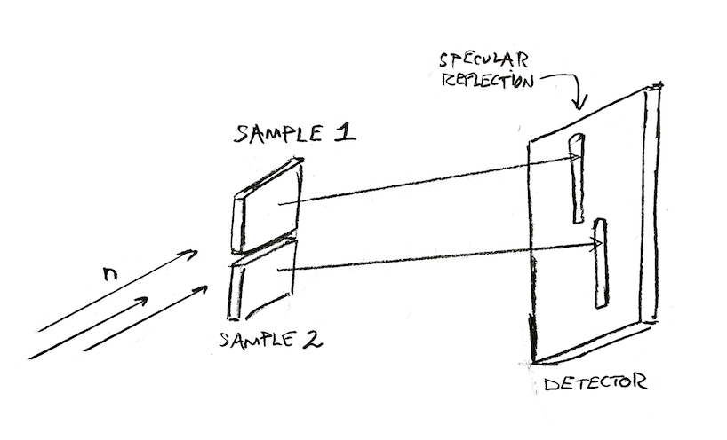

.. multiple_samples

Multiple Samples in a single Run
================================

The Magnetism Reflectometer can stack several (usually 2, rarely 3) samples on top of each other.
The beam is wide enough to cover all the samples.
To measure reflectivity, the beam is very narrow in the other direction (so it’s like a thin ribbon).
Because we are sensitive to tiny angles,
the reflection from each sample will appear in different sports on the detector.
With one sample, there will be one spot on the detector.
With two, there will be two if (1) the samples are not exactly parallel
(in which case it will still look like one spot) and
(2) the samples are parallel enough so that both spots are on the detector
(otherwise one of the spots may be outside the detector surface.

   Reflectometry from two samples stacked.
