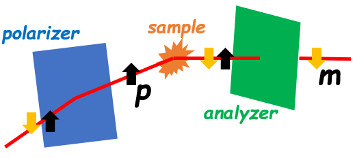

.. _polarization:

Polarization
============

In the REF_M instrument, a polarizer is placed in front of the sample and an analyzer is place behind the sample.
This spin setup selects the spin state of the neutrons before and after they interact with the sample.
They project the spin along a particular direction, and the selected spin state is either "up" or "down" along
this direction.

Processing variables (PV) ``Polarizer`` and ``Analyzer`` indicate whether any of these spin selectors has been
installed and are in use. Given a particular ``Polarizer``, PV ``PolarizerState`` indicates the selected
"up" or "down" state. PV variable ``AnalyzerState`` plays an analogous role for the analyzer.

The following tables summarize the possible values of ``Polarizer`` and ``Analyzer`` along with corresponding
``PolarizerState`` and ``AnalyzerState`` values. Lastly, the table also shows the corresponding
ORSO polarization value that is used when saving the reduced data to ORSO format

+-----------------------+-------------------+-------------------------+
| PV Polarizer          | PV PolarizerState | ORSO Polarization Value |
+=======================+===================+=========================+
| 0 - No Polarizer      |                   | o - "unpolarized"       |
+-----------------------+-------------------+-------------------------+
| 1 - Reflection        | 1 - ON            | m - "minus" or "down"   |
+-----------------------+-------------------+-------------------------+
| 1 - Reflection        | 0 - OFF           | p - "plus" or "up"      |
+-----------------------+-------------------+-------------------------+
| 2 - Transmission      | 1 - ON            | p                       |
+-----------------------+-------------------+-------------------------+
| 2 - Transmission      | 0 - OFF           | m                       |
+-----------------------+-------------------+-------------------------+
| 3 - Undefined         |                   | o                       |
+-----------------------+-------------------+-------------------------+

+-----------------------+-------------------+-------------------------+
| PV Analyzer           | PV AnalyzerState  | ORSO Polarization Value |
+=======================+===================+=========================+
| 0 - No Analyzer       |                   | o  - "unpolarized"      |
+-----------------------+-------------------+-------------------------+
| 1 - Fan & SF2         | 1 - ON            | m - "minus" or "down"   |
+-----------------------+-------------------+-------------------------+
| 1 - Fan & SF2         | 0 - OFF           | p - "plus" or "up"      |
+-----------------------+-------------------+-------------------------+
| 2 - 3He               | 1 - ON            | p                       |
+-----------------------+-------------------+-------------------------+
| 2 - 3He               | 0 - OFF           | m                       |
+-----------------------+-------------------+-------------------------+
| 3 - Undefined         |                   | o                       |
+-----------------------+-------------------+-------------------------+
