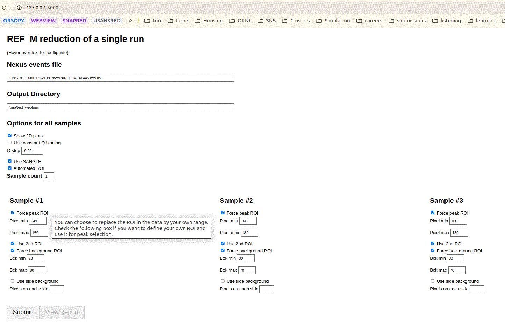
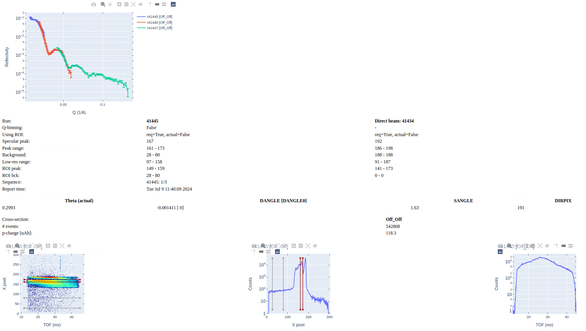
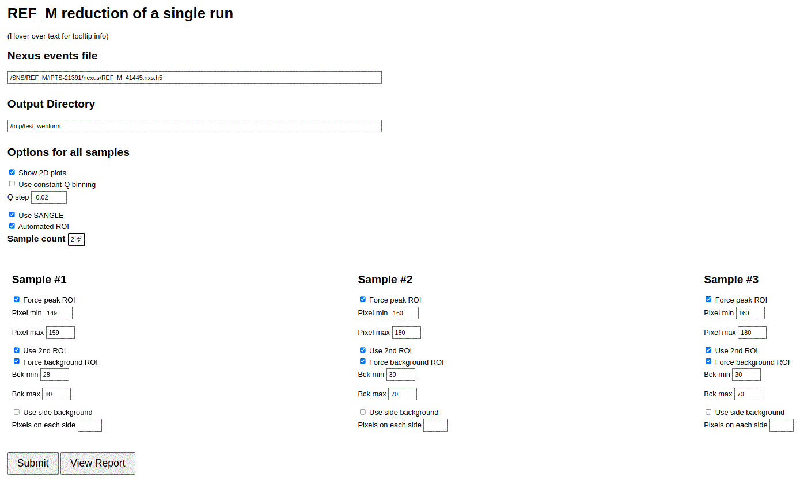
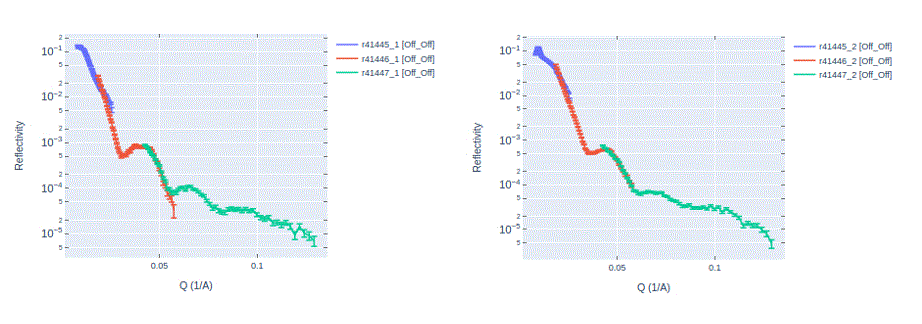

.. using_reduce_script

Reduction
=========

Manual Reduction
----------------
Terminal command `reduce_REF_M` is available on the conda environments `mr_reduction-qa` and `mr_reduction`.
Running this command starts a simple web application to configure reduction of a single experiment.

 .. code-block:: bash

   > reduce_REF_M
   **********************************************
   * POINT YOUR BROWSER TO http://127.0.0.1:5000/
   **********************************************
   [2024-07-09 11:20:06 -0400] [278702] [INFO] Starting gunicorn 21.2.0
   [2024-07-09 11:20:06 -0400] [278702] [INFO] Listening at: http://0.0.0.0:5000 (278702)
   [2024-07-09 11:20:06 -0400] [278702] [INFO] Using worker: sync
   [2024-07-09 11:20:06 -0400] [278707] [INFO] Booting worker with pid: 278707

As the printout suggest, open a tab in your browser and enter address `http://127.0.0.1:5000/`.
This webapp allows one to reduce a single run by entering the Nexus events file, entering the directory
storing the reduced files, and selecting reduction options.
Hovering over the bold-face text items will show explanatory tooltips.

   Configuration for manual reduction.

Click on the **Submit** button to start reduction. The reduction typically takes one to two minutes during which
time both **Submit** and **View Report** buttons became disabled. After reduction is finished,
click on **View Report** for a summary of the results.

   Report for the manual reduction.

The report shown is HTML file `/tmp/test_webform/REF_M_REF_M_41445.html`, where `/tmp/test_webform/` is the
output directory we selected.

Notice how the report shows the superposition of reflectivity curves for runs 41445, 41446, and 41447. This
will happen if reduced files for runs 41446 and 41447 are found either in the output directory `/tmp/test_webform`
or the canonical output directory for autoreduction of runs corresponding to run 41445 which in this
case is `/SNS/REF_M/IPTS-21391/shared/autoreduce/`. Runs 41445, 41446, and 41447 correspond to experiments
taken on the same sample but with a different incidence angle.

The webapp supports reduction of up to three samples for the scenarios when the run contains more than one sample.
In the following screenshot we selected `Sample Count=2`, causing reduction taking into account options
from `Sample #1` and `Sample #2`.

   Reduction of two samples.

The below excerpt from the corresponding report show the reflectivity curves for the two samples (41445_1 and 41445_2).

   Report for two samples.

Automated Reduction
-------------------

The set of reduction options available in the manual reduction is also available in
`https://monitor.sns.gov/reduction/ref_m/`. Updating these options ensure that auto-reduction
of future experiment will employ the new options.
Auto-reduced files are saved under directory `/SNS/REF_M/IPTS-XYZ/shared/autoreduce/`, where `XYZ` corresponds
to the IPTS number associated to whatever run number is to be auto-reduced.
