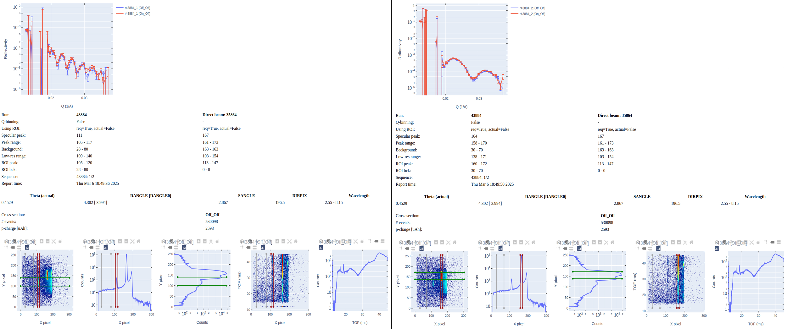

.. _using_reduce_script:

Reduction
=========

Manual Reduction
----------------
Terminal command `reduce_REF_M` is available on the conda environments `mr_reduction-qa` and `mr_reduction`.
Running this command starts a simple web application to configure reduction of a single experiment.

Developers or power users running their own conda environment from `environment.yml`,
and having installed the package in editable mode,
can invoke the webapp by running script `src/mr_autoreduce/reduce_REF_M_run.sh`

 .. code-block:: bash

   > reduce_REF_M
   **********************************************
   * POINT YOUR BROWSER TO http://127.0.0.1:5000/
   **********************************************
   [2024-07-09 11:20:06 -0400] [278702] [INFO] Starting gunicorn 21.2.0
   [2024-07-09 11:20:06 -0400] [278702] [INFO] Listening at: http://0.0.0.0:5000 (278702)
   [2024-07-09 11:20:06 -0400] [278702] [INFO] Using worker: sync
   [2024-07-09 11:20:06 -0400] [278707] [INFO] Booting worker with pid: 278707

As the printout suggest, open a tab in your browser and enter address `http://127.0.0.1:5000/`.
This webapp allows one to reduce a single run by entering the Nexus events file, entering the directory
storing the reduced files, and selecting reduction options.
Hovering over the bold-face text items will show explanatory tooltips.

.. figure:: ./media/manual_reduction.GIF
   :alt: Configuration for manual reduction.
   :align: center
   :width: 900

   Configuration for manual reduction.

Click on the **Submit** button to start reduction. The reduction typically takes one to two minutes during which
time both **Submit** and **View Report** buttons became disabled. After reduction is finished,
click on **View Report** for a summary of the results.

   Report for the manual reduction.

The report shown is HTML file `/tmp/test_webform/REF_M_REF_M_41445.html`, where `/tmp/test_webform/` is the
output directory we selected.

Notice how the report shows the superposition of reflectivity curves for runs 41445, 41446, and 41447. This
will happen if reduced files for runs 41446 and 41447 are found either in the output directory `/tmp/test_webform`
or the canonical output directory for autoreduction of runs corresponding to run 41445 which in this
case is `/SNS/REF_M/IPTS-21391/shared/autoreduce/`. Runs 41445, 41446, and 41447 correspond to experiments
taken on the same peak but with a different incidence angle.

Reduction of a Sample with Two Peaks
++++++++++++++++++++++++++++++++++++
The webapp supports reduction of up to three peaks for the scenarios when the run contains more than one peak.
This typically arise when the sample has layers with slightly different orientations with respect
to the incoming beam. Thus, the layers will reflect neutrons at slightly different angles. This
results in distinct intensity regions (peaks) in the detector panel.

The picture below shows two runs (42536 and 39012) each one reflecting two distinct intensity regions.

For run 42536, identifying two distinct ranges along the X-axis suffices to differentiate the two peaks.
For run 39012, two distinct ranges along the Y-axis suffice to differentiate the two peaks.

We'll reduce the run series 43884 and 43885.
These runs contain two peaks as shown in the figure below for run 43885.

We should start with the first run of the series, in this case run 43884, by invoking the webapp from the terminal.
Even though the two peaks are well resolved along the X-axis,
we'll also define a range along the Y-axis,
also termed the low-resolution axis because the peak is spread out over many pixels along this direction.

A few things to notice in the above figure:

- We pass the path to the events file for run 43884.
- We set up the output directory. If the directory doesn't exist, do create it **before** submitting the form.
- We specified the peak count to two peaks.
- For Peak #1, we specified the range along the X-axis ("Force peak ROI") as well as the Y-axis ("Force Low Res ROI").
- We do likewise for Peak #2.

We start the reduction by pressing the **Submit** button.
After the reduction is finished, we can view the report by pressing the **View Report** button:

The report shows the reflectivity of the two cross-sections ("Off_Off" and "On_Off")
for Peak #1 ("43884_1") and Peak #2 ("43884_2").

We continue by reducing the second run in the series (43885).
The only change we make in the form is to pass the path to the events file for run 43885.
Beforehand we made sure that the ranges for "Force peak ROI" and "Force Low Res ROI" that
we used when reducing 43884 also encompass the peaks observed in run 43885.
Notice that we will output the reducted data to the same directory as for run 43884.
This way we'll have all the necessary output data to stitch together the reflectivity curves of the two runs.

As before, we view the report by pressing the **View Report** button:

We notice in the report that reflectivity curves for the two runs are shown, stitched together.
There are four curves in each plot so it can be difficult to discern the stitching for a given cross-section.
You can hide one curve by clicking on the legend.
In the figure below, on the legend, I clicked on "r43884_2 [On_Off]" and "r43885_2 [On_Off]" to hide them,
leaving a clearer view of the stitching for the "Off_Off" cross-section.

In the output directory,
the files containing the reflectivity curves in ASCII format are `REF_M_*_autoreduce.dat`
for individual runs and `REF_M_*_combined.dat` for stitched runs.

Automated Reduction
-------------------

The set of reduction options available in the manual reduction is also available in
`https://monitor.sns.gov/reduction/ref_m/`. Updating these options ensure that auto-reduction
of future experiment will employ the new options.
Auto-reduced files are saved under directory `/SNS/REF_M/IPTS-XYZ/shared/autoreduce/`, where `XYZ` corresponds
to the IPTS number associated to whatever run number is to be auto-reduced.
