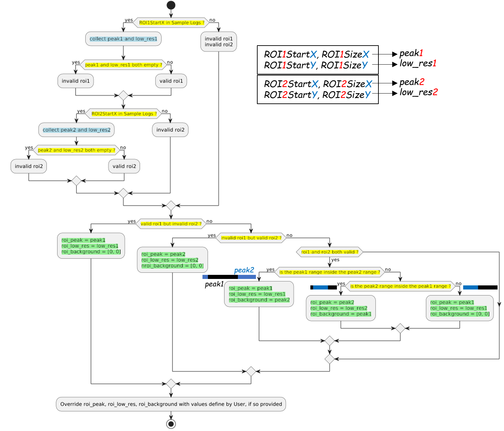

.. _roi:

Region of Interest (ROI)
========================

Nexus event files contain Processing Variables (PV) as metadata.
The following PV's define two rectangular regions of interest (ROI) in the detector:

- `ROI1StartX`, `ROI1SizeX`, `ROI1StartY`, and `ROI1SizeY` define the first ROI.
- `ROI2StartX`, `ROI2SizeX`, `ROI2StartY`, and `ROI2SizeY` define the second ROI.

`mr_reduction` invokes Mantid algorithm
`MRInspectData <https://docs.mantidproject.org/nightly/algorithms/MRInspectData-v1.html>`_
to extract these ROI and then determine
the peak range (peak width along the horizontal axis)
and the low-resolution range (peak width along the vertical axis).
If one of the ROI is bounded by the other,
the bounded ROI is considered the peak and the bounding ROI is considered the background.

The following diagram illustrates the logic implemented in `MRInspectData`
when determining the peak and background regions:

   (user/media/roi_pv_digest.puml)
