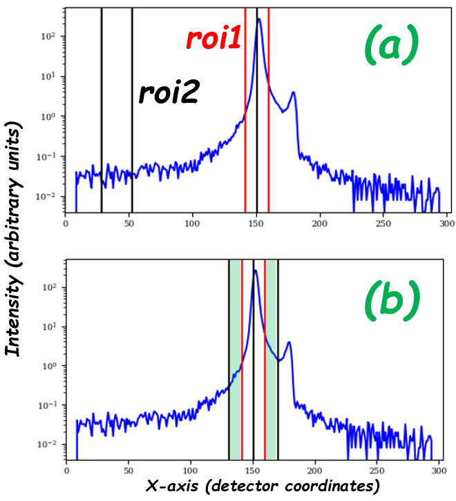

.. _roi:

Region of Interest (ROI)
========================

Nexus event files contain Processing Variables (PV) as metadata.
The following PV's define two rectangular regions of interest (ROI) in the detector to limit the ranges
of the peak and background regions in the detector:

- ``ROI1StartX``, ``ROI1SizeX``, ``ROI1StartY``, and ``ROI1SizeY`` define the region enclosing the peak
- ``ROI2StartX``, ``ROI2SizeX``, ``ROI2StartY``, and ``ROI2SizeY`` define the background region for the peak

There are two valid ROI configurations, as shown in the following picture:

In configuration `(a)`, the peak region is defined by ``ROI1`` and the background region is defined by ``ROI2``.
The regions don't overlap.
In configuration `(b)`, the background region used for reduction will be the region of ``ROI2``
that doesn't overlap with ``ROI1`` (the region shaded in green).
This type of background is termed as "side background".

When the experiments contains multiple reflected peaks, additional PV's are used:

- ``ROI3StartX``, ``ROI3SizeX``, ``ROI3StartY``, and ``ROI3SizeY`` define the region enclosing the second peak
- ``ROI4StartX``, ``ROI4SizeX``, ``ROI4StartY``, and ``ROI4SizeY`` define the background region for the second peak
- ``ROI5StartX``, ``ROI5SizeX``, ``ROI5StartY``, and ``ROI5SizeY`` define the region enclosing the third peak
- ``ROI6StartX``, ``ROI6SizeX``, ``ROI6StartY``, and ``ROI6SizeY`` define the background region for the third peak
